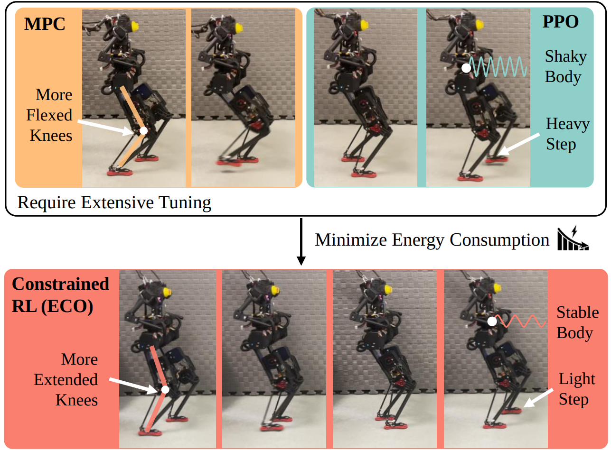

<div id="top" align="center">


<h2>ECO: Energy-Constrained Optimization with Reinforcement Learning for Humanoid Walking</h2>

<p align="center">
  <a href="https://sites.google.com/view/eco-humanoid">
    
  </a>
  <!-- Add arXiv / DOI badges when available -->
  <!-- <a href="https://arxiv.org/abs/XXXX.XXXXX">
    
  </a> -->
  
</p>

<p align="center">
  <b><a href="https://weidonghuang.com" target="_blank" rel="noopener noreferrer">Weidong Huang</a></b><sup>*</sup> ·
  <a href="https://jingwen-zhang-aaron.github.io/" target="_blank" rel="noopener noreferrer">Jingwen Zhang</a><sup>*, †</sup> ·
  Jiongye Li ·
  Shibowen Zhang ·
  Jiayang Wu ·
  Jiayi Wang ·
  Hangxin Liu ·
  Yaodong Yang ·
  <a href="https://yaosu.info/" target="_blank" rel="noopener noreferrer">Yao Su</a><sup>†</sup>
  <br>
  <sup>*</sup>Equal contribution · <sup>†</sup>Corresponding authors
</p>

> We release ECO training/evaluation code together with baseline implementations: **PPO**, **IPO**, **P3O**, and **CRPO**.


</div>

---

## 🔥 Highlights

- **Energy as an explicit constraint (not a reward term):** ECO reformulates motor energy consumption as an inequality constraint for more **interpretable** and **tunable** energy optimization.
- **Stable + energy-efficient humanoid walking:** Achieves robust locomotion while driving energy down to a target budget via **PPO-Lagrangian** (primal-dual updates).
- **Real-world validation on BRUCE:** Demonstrates sim-to-real deployment with substantially reduced energy consumption compared to **MPC** and **standard PPO**.
- **Emergent efficient behaviors:** Reduced body shaking, lighter steps, and less flexed knees—without manually prescribing “efficient gait” heuristics.

---

## 📋 Overview
<p align="center">
  <!-- Reuse your paper figure as the README teaser -->
  <!-- Option A (recommended): export `figures/motivation.pdf` to PNG and put it under `assets/` -->
  
</p>

**ECO (Energy-Constrained Optimization)** is a constrained reinforcement learning framework for humanoid locomotion that separates *task rewards* (e.g., velocity tracking, stability) from *energy optimization* by treating energy as an explicit constraint.

Instead of tuning many reward weights (often non-intuitive and time-consuming), ECO uses **physically meaningful thresholds** for constraints:

- **Energy constraint**: discounted cumulative motor power (torque × joint velocity)
- **Reference motion / symmetry constraint**: mirror-consistency loss to encourage stable and symmetric gait

ECO is trained with **PPO-Lagrangian**, which dynamically adjusts the Lagrange multipliers to satisfy constraints during learning.

**Project website (demos + videos):** https://sites.google.com/view/eco-humanoid


---

## 🏃 Results (at a glance)

- **Constraint RL baselines compared:** PPO-Lag (ECO), IPO, P3O, CRPO, plus MPC and standard PPO (reward shaping).
- **Sim-to-sim transfer:** policies transferred across **Isaac Gym → MuJoCo / Gazebo** with stable walking and consistent energy reduction.
- **Sim-to-real on BRUCE:** ECO maintains low motor power near the specified budget while remaining robust.

> For qualitative demos and detailed plots, see the project website:
> https://sites.google.com/view/eco-humanoid

---

## 📦 Code

Run all commands from the repository root.
Tested environment: Ubuntu 22.04.5 LTS with NVIDIA GeForce RTX 4090.

### Installation

```bash
# create and activate conda env
conda create -n bruce_gym python=3.8 -y
conda activate bruce_gym

# install pytorch (CUDA 11.7)
pip install torch==1.13.1+cu117 torchvision==0.14.1+cu117 \
  --extra-index-url https://download.pytorch.org/whl/cu117

# install Isaac Gym (Preview 4) after PyTorch
# download Isaac Gym from the official NVIDIA Isaac Gym website,
# unzip it, then run:
cd isaacgym/python
pip install -e .
cd ../..

# install project + dependencies from setup.py / requirements.py
pip install -e .
```

### Ubuntu 22.04 (Isaac Gym)

Before running Isaac Gym training/play on Ubuntu 22.04, set:

```bash
export CC=/usr/bin/gcc-11
export CXX=/usr/bin/g++-11

# use your own environment path (recommended)
export LD_LIBRARY_PATH="$CONDA_PREFIX/lib:$LD_LIBRARY_PATH"

# optional: if Isaac Gym still cannot find libpython3.8.so.1.0,
# locate it manually and export that directory:
find / -name "*ibpython3.8.so.1.0*" 2>/dev/null
# example only, replace with your own path:
# export LD_LIBRARY_PATH=/home/<your_username>/miniconda3/envs/bruce_gym/lib:$LD_LIBRARY_PATH
```

### Train (Isaac Gym)

Training setup note:
- To reproduce the training curve from the original paper, use `mesh_type = 'plane'` and `num_envs = 4096`.
- Using `num_envs = 8192` uses more GPU memory but can converge faster.
- Using `mesh_type = 'trimesh'` is recommended when targeting a more robust sim-to-real policy.
- Current paper-reproduction command setting is `lin_vel_x = [0.1, 0.1]` and `lin_vel_y = [0.0, 0.0]` (in `commands.ranges`).
- To train policies that can run at different velocity commands, increase the command ranges (especially `lin_vel_x`, and optionally `lin_vel_y`) instead of fixing them to single values.
- These parameter settings can be changed in config files under `bruce_gym/envs/custom/` (for example `bruce_gym/envs/custom/brucewalk_config.py` and related `brucewalk_config_*.py` files).

```bash
# ECO (PPO-Lagrangian)
python bruce_gym/scripts/train.py \
  --task=bruce_ppolag \
  --headless \
  --run_name=eco_ppolag_train \
  --sim_device=cuda:0 \
  --rl_device=cuda:0

# PPO baseline
python bruce_gym/scripts/train.py \
  --task=bruce_ppo \
  --headless \
  --run_name=baseline_ppo_train \
  --sim_device=cuda:0 \
  --rl_device=cuda:0

# IPO baseline
python bruce_gym/scripts/train.py \
  --task=bruce_ipo \
  --headless \
  --run_name=baseline_ipo_train \
  --sim_device=cuda:0 \
  --rl_device=cuda:0

# P3O baseline
python bruce_gym/scripts/train.py \
  --task=bruce_p3o \
  --headless \
  --run_name=baseline_p3o_train \
  --sim_device=cuda:0 \
  --rl_device=cuda:0

# CRPO baseline
python bruce_gym/scripts/train.py \
  --task=bruce_crpo \
  --headless \
  --run_name=baseline_crpo_train \
  --sim_device=cuda:0 \
  --rl_device=cuda:0
```

### Play (Isaac Gym)

We store trained models in `logs/exp/`. Before evaluation, choose the target run directory from `logs/exp/<timestamp>_<run_name>` and use that path for `--load_run` / `--load_model`.

```bash
python bruce_gym/scripts/play.py \
  --task=bruce_ppolag \
  --load_run=<run_name_or_absolute_run_path> \
  --checkpoint=<checkpoint_id>
```

### Play (MuJoCo)

```bash
python bruce_gym/scripts/sim2sim_bruce.py \
  --load_model=<absolute_run_path> \
  --checkpoint=<checkpoint_id>
```

Optional: add `--terrain` to use terrain MJCF.

### Play (Gazebo)

Gazebo playback depends on the **BRUCE official library**.
Install that library first, otherwise `bruce_gym/scripts/gazebo/*` will fail on BRUCE interface imports.
Also replace `~/.gazebo/models/bruce/model.sdf` with `bruce_gym/scripts/gazebo/model.sdf` before running Gazebo playback.

Typical setup:

```bash
# from your BRUCE official library repo
pip install -e .
pip install termcolor==1.1.0
pip install numba==0.49.0
python3 -m Startups.memory_manager
```

Start Gazebo first:

```bash
gzserver bruce.world
```

Then run:

```bash
python bruce_gym/scripts/gazebo/test_checkpoint.py \
  --task=bruce_ppolag \
  --load_run=<run_name_or_absolute_run_path> \
  --checkpoint=<checkpoint_id>
```

If your local package path is `humanoid/` instead of `bruce_gym/`, replace the script prefix accordingly.


---

## 📌 BibTeX

If you find this work useful, please consider citing:

```bibtex
@ARTICLE{eco_humanoid,
  author={Huang, Weidong and Zhang, Jingwen and Li, Jiongye and Zhang, Shibowen and Wu, Jiayang and Wang, Jiayi and Liu, Hangxin and Yang, Yaodong and Su, Yao},
  journal={IEEE Transactions on Automation Science and Engineering}, 
  title={ECO: Energy-Constrained Optimization With Reinforcement Learning for Humanoid Walking}, 
  year={2026},
  volume={23},
  number={},
  pages={4861-4876},
  keywords={Legged locomotion;Humanoid robots;Energy efficiency;Energy consumption;Tuning;Optimization;Costs;Stability criteria;Reinforcement learning;Automation;Humanoid and bipedal locomotion;constrained reinforcement learning;legged robots},
  doi={10.1109/TASE.2026.3662755}}
