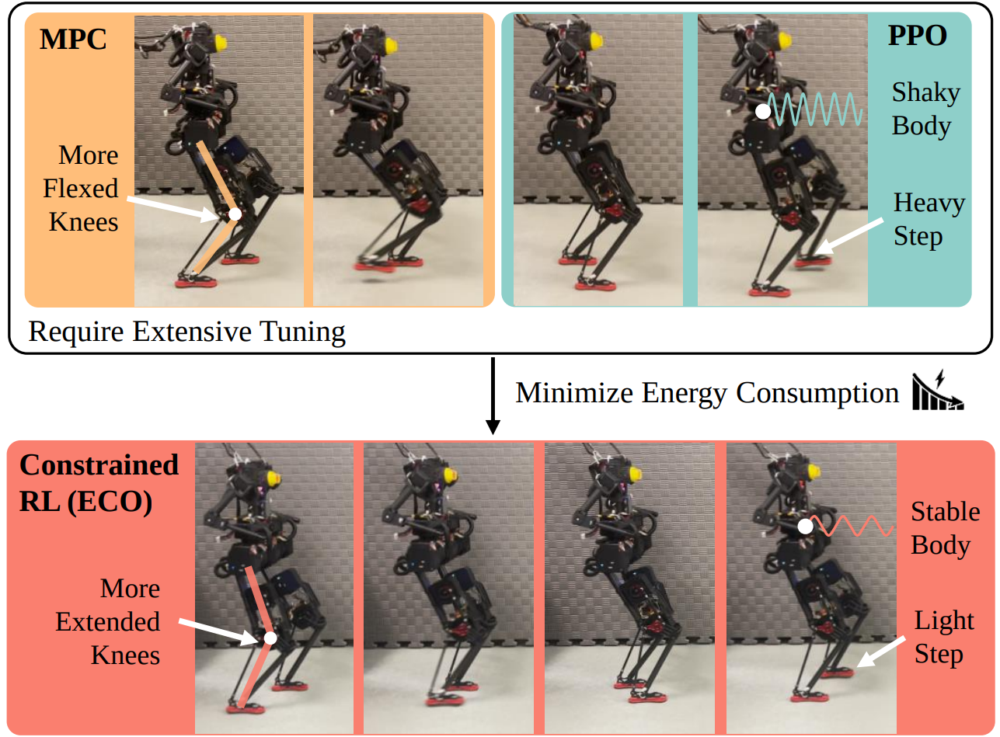

<div id="top" align="center">


<h2>ECO: Energy-Constrained Optimization with Reinforcement Learning for Humanoid Walking</h2>

<p align="center">
  <a href="https://sites.google.com/view/eco-humanoid">
    
  </a>
  <!-- Add arXiv / DOI badges when available -->
  <!-- <a href="https://arxiv.org/abs/XXXX.XXXXX">
    
  </a> -->
  
</p>

<p align="center">
  <b><a href="https://weidonghuang.com">Weidong Huang</a></b><sup>*</sup> ·
  Jingwen Zhang<sup>*, †</sup> ·
  Jiongye Li ·
  Shibowen Zhang ·
  Jiayang Wu ·
  Jiayi Wang ·
  Hangxin Liu ·
  Yaodong Yang ·
  Yao Su<sup>†</sup>
  <br>
  <sup>*</sup>Equal contribution · <sup>†</sup>Corresponding authors
</p>


</div>

---

## 🔥 Highlights

- **Energy as an explicit constraint (not a reward term):** ECO reformulates motor energy consumption as an inequality constraint for more **interpretable** and **tunable** energy optimization.
- **Stable + energy-efficient humanoid walking:** Achieves robust locomotion while driving energy down to a target budget via **PPO-Lagrangian** (primal-dual updates).
- **Real-world validation on BRUCE:** Demonstrates sim-to-real deployment with substantially reduced energy consumption compared to **MPC** and **standard PPO**.
- **Emergent efficient behaviors:** Reduced body shaking, lighter steps, and less flexed knees—without manually prescribing “efficient gait” heuristics.

---

## 📋 Overview
<p align="center">
  <!-- Reuse your paper figure as the README teaser -->
  <!-- Option A (recommended): export `figures/motivation.pdf` to PNG and put it under `assets/` -->
  
</p>

**ECO (Energy-Constrained Optimization)** is a constrained reinforcement learning framework for humanoid locomotion that separates *task rewards* (e.g., velocity tracking, stability) from *energy optimization* by treating energy as an explicit constraint.

Instead of tuning many reward weights (often non-intuitive and time-consuming), ECO uses **physically meaningful thresholds** for constraints:

- **Energy constraint**: discounted cumulative motor power (torque × joint velocity)
- **Reference motion / symmetry constraint**: mirror-consistency loss to encourage stable and symmetric gait

ECO is trained with **PPO-Lagrangian**, which dynamically adjusts the Lagrange multipliers to satisfy constraints during learning.

**Project website (demos + videos):** https://sites.google.com/view/eco-humanoid


---

## 🏃 Results (at a glance)

- **Constraint RL baselines compared:** PPO-Lag (ECO), IPO, P3O, CRPO, plus MPC and standard PPO (reward shaping).
- **Sim-to-sim transfer:** policies transferred across **Isaac Gym → MuJoCo / Gazebo** with stable walking and consistent energy reduction.
- **Sim-to-real on BRUCE:** ECO maintains low motor power near the specified budget while remaining robust.

> For qualitative demos and detailed plots, see the project website:
> https://sites.google.com/view/eco-humanoid

---

## 📦 Code

**Code is coming soon.**  
We will release training, evaluation code.


---

## 📌 BibTeX

If you find this work useful, please consider citing:

```bibtex
@article{eco2026,
    title={ECO: Energy-Constrained Optimization with Reinforcement Learning for Humanoid Walking}, 
    author={Weidong Huang and Jingwen Zhang and Jiongye Li and Shibowen Zhang and Jiayang Wu and Jiayi Wang and Hangxin Liu and Yaodong Yang and Yao Su},
    journal      = {IEEE Transactions on Automation Science and Engineering},
    year         = {2026},
    month        = feb,
    note         = {Accepted for publication. arXiv preprint},
    url          = {https://arxiv.org/abs/2602.06445},
    archivePrefix= {arXiv},
    eprint       = {2602.06445}
}

